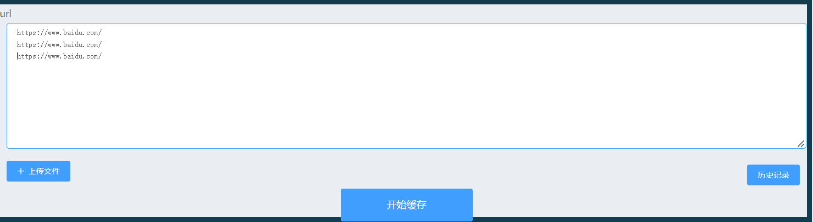
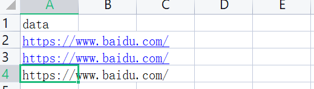
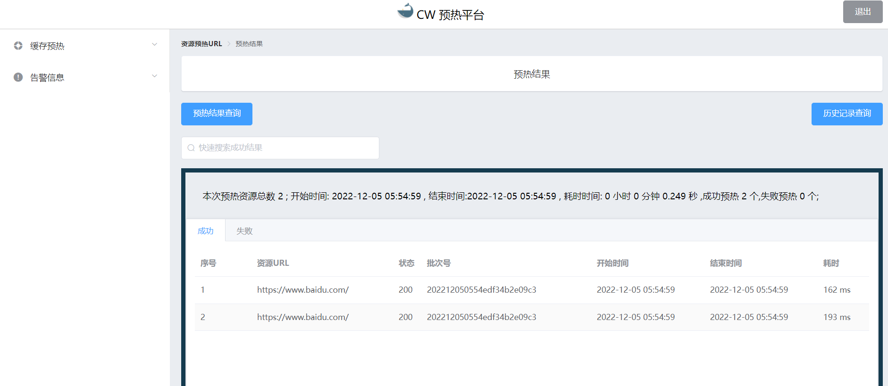
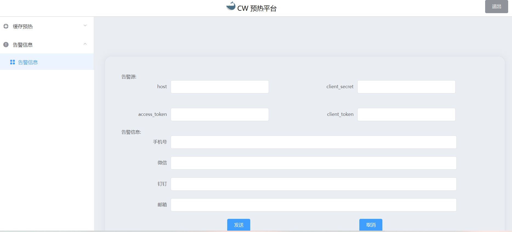

# 使用文档

### 登录 
   
    本平台接入本公司auth账号管理系统，具有auth账号即可登录。

 点击登录按钮，跳转auth。

 注册账号登录即可。

----
----

###  缓存预热

1.缓存

    可通过在url框内手动输入，或进行excel表格批量存储。格式如下图所示。

手动输入

 

文件上传

 

2.预热

    点击缓存结束，可进行再次缓存。点击预热按钮即可进行批量预热。

### 结果查询

    点击预热后自动跳转至结果页面，也可点击首页的历史记录进行查询相关批次的记录。
    失败的记录可以点击预热结果查询再次进行预热。

### 告警信息

    如果预热url量比较大，短时间无法预热完成，可以通过告警信息模块进行结果的通知。

    
