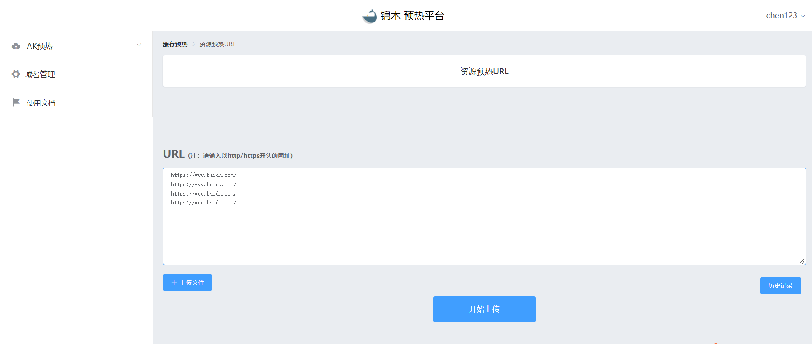
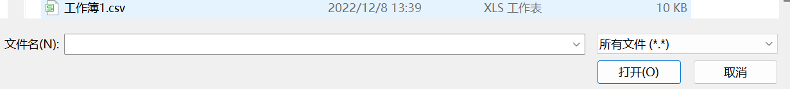
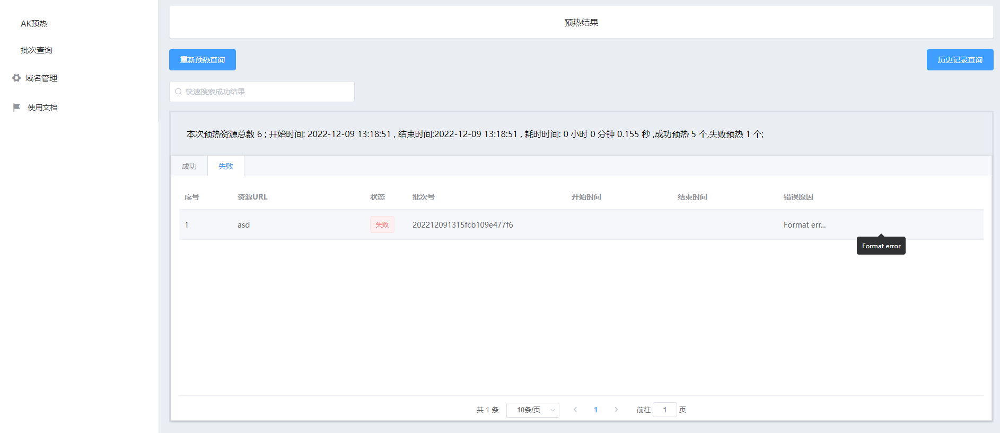

# 使用文档

### 登录 
   
    本平台接入本公司auth账号管理系统，具有auth账号即可登录。

 
点击登录按钮，跳转auth。

 注册账号登录即可。

----
----

###  缓存预热

1.缓存

    可通过在url框内手动输入，或将表格内url批量存储。点击开始上传即对本次提供的url进行存储。

手动输入

文件上传(仅支持xlsx,scv文件格式)

----

2.预热

    url存储完成后，可在页面浏览此次所上传url大致内容。
    点击预热按钮即可对本批次的url进行预热。

### 结果查询

    点击预热后自动跳转至结果页面，也可点击首页的历史记录进行查询相关批次的记录。
    点击重新预热查询可对本批次再次进行预热。

预热成功显示样例

预热失败显示样例

----
----

### 批次处理
    
    每次上传url时自动生成一个批次ID，作为本次上传url的批次号。
    在批次查询页面可看到用户名下所有的批次ID与对应批次的url个数。
    点击预热按钮可针对所对应的批次进行再次预热。

----
----

### 域名管理

    域名管理处可配置域名与其对应的ip，类似于curl命令 --resolve。
    用户可根据自身情况对其配置。

    
----
----

### 历史查询

    对于当前用户所有预热的url，根据成功与失败进行分割显示。
    用户只需选择日期即可查询所选范围内的历史记录。
    对于失败的记录可在批次管理处进行再次预热。

----
----
